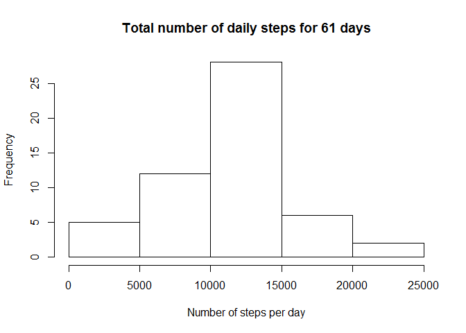
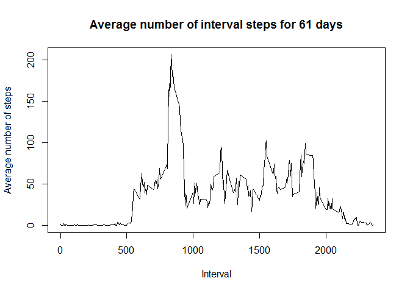
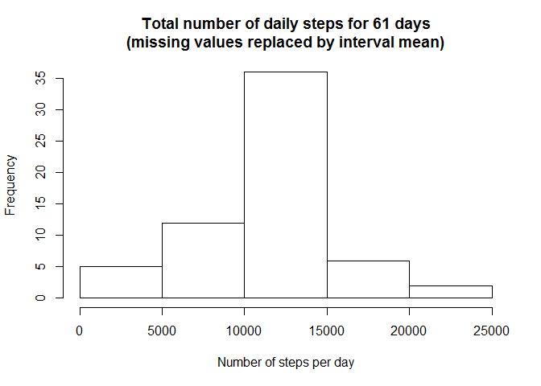
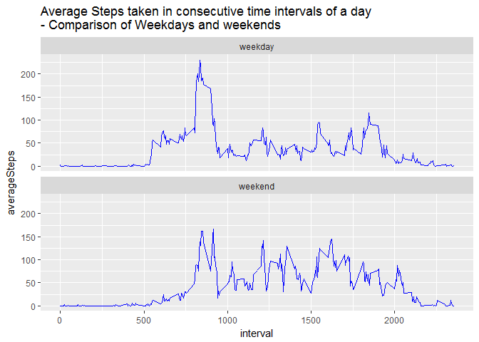

    knitr::opts_chunk$set(echo = TRUE)
    library(lubridate)

    ## 
    ## Attaching package: 'lubridate'

    ## The following object is masked from 'package:base':
    ## 
    ##     date

    library(dplyr)

    ## 
    ## Attaching package: 'dplyr'

    ## The following objects are masked from 'package:lubridate':
    ## 
    ##     intersect, setdiff, union

    ## The following objects are masked from 'package:stats':
    ## 
    ##     filter, lag

    ## The following objects are masked from 'package:base':
    ## 
    ##     intersect, setdiff, setequal, union

    library(zoo)

    ## 
    ## Attaching package: 'zoo'

    ## The following objects are masked from 'package:base':
    ## 
    ##     as.Date, as.Date.numeric

    library(ggplot2)
    options(scipen=999) # no scientific notation

Loading and preprocessing the data
----------------------------------

    # 1. Load the data
    mydata <- read.csv(file='activity.csv')
    head(mydata)

    ##   steps       date interval
    ## 1    NA 2012-10-01        0
    ## 2    NA 2012-10-01        5
    ## 3    NA 2012-10-01       10
    ## 4    NA 2012-10-01       15
    ## 5    NA 2012-10-01       20
    ## 6    NA 2012-10-01       25

    str(mydata)

    ## 'data.frame':    17568 obs. of  3 variables:
    ##  $ steps   : int  NA NA NA NA NA NA NA NA NA NA ...
    ##  $ date    : Factor w/ 61 levels "2012-10-01","2012-10-02",..: 1 1 1 1 1 1 1 1 1 1 ...
    ##  $ interval: int  0 5 10 15 20 25 30 35 40 45 ...

    # 2. Process / transform the data
    mydata$date <- ymd(mydata$date) # ymd from package lubridate
    str(mydata)

    ## 'data.frame':    17568 obs. of  3 variables:
    ##  $ steps   : int  NA NA NA NA NA NA NA NA NA NA ...
    ##  $ date    : Date, format: "2012-10-01" "2012-10-01" ...
    ##  $ interval: int  0 5 10 15 20 25 30 35 40 45 ...

What is the mean total number of steps taken per day?
-----------------------------------------------------

    # 1. Calculate the total number of steps taken per day
    mysteps <- mydata %>% 
        group_by(date) %>% 
        summarise(sumSteps = sum(steps))
    mysteps 

    ## # A tibble: 61 × 2
    ##          date sumSteps
    ##        <date>    <int>
    ## 1  2012-10-01       NA
    ## 2  2012-10-02      126
    ## 3  2012-10-03    11352
    ## 4  2012-10-04    12116
    ## 5  2012-10-05    13294
    ## 6  2012-10-06    15420
    ## 7  2012-10-07    11015
    ## 8  2012-10-08       NA
    ## 9  2012-10-09    12811
    ## 10 2012-10-10     9900
    ## # ... with 51 more rows

    # 2. Make a histogram
    hist(x = mysteps$sumSteps, main = 'Total number of daily steps for 61 days', 
         xlab = 'Number of steps per day')

    # 3. Calculate and report the mean and median
    stepsMean <- round(mean(mysteps$sumSteps, na.rm = TRUE), digits = 1)
    stepsMedian <- round(median(mysteps$sumSteps, na.rm = TRUE), digits = 1)

The mean of the total number of steps taken per day is **10766.2**, the
median is **10765**.

What is the average daily activity pattern?
-------------------------------------------

    # 1. Make a time series plot of the 5-minute interval and the average number of steps taken
    mysteps2 <- mydata %>% 
        group_by(interval) %>% 
        summarise(meanSteps = mean(steps, na.rm = TRUE))
    plot(x = mysteps2$interval, y = mysteps2$meanSteps, type = 'l',
         ylab = 'Average number of steps', xlab = 'Interval',
         main = 'Average number of interval steps for 61 days')

    # 2. Which interval contains the maximum number of steps?
    maxInterval <- mysteps2[mysteps2$meanSteps == max(mysteps2$meanSteps),][1]

The interval with the maximum number of steps is **835**.

Imputing missing values
-----------------------

    # 1. Calculate & report the number of rows with NAs
    mydata <- mutate(mydata, complete = complete.cases(mydata)) # add variable that indicates completeness
    complete <- sum(mydata$complete == TRUE)
    incomplete <- sum(mydata$complete == FALSE)
    pincomplete <- round(incomplete/(complete + incomplete), digits = 3)
    # 2. Devise a strategy for filling in all of the missing values in the dataset

In 17568 cases there are **2304** cases with NAs (p = 0.131).

Missing values will be replaced by average steps of the respective
interval.

    # 3. Create a new dataset with missing data filled in
    mydata2 <- mydata
    head(mydata2) 

    ##   steps       date interval complete
    ## 1    NA 2012-10-01        0    FALSE
    ## 2    NA 2012-10-01        5    FALSE
    ## 3    NA 2012-10-01       10    FALSE
    ## 4    NA 2012-10-01       15    FALSE
    ## 5    NA 2012-10-01       20    FALSE
    ## 6    NA 2012-10-01       25    FALSE

    # library zoo => na.aggregate()
    mydata2$steps <- na.aggregate(mydata2$steps, by = mydata2$interval, na.rm = TRUE)
    head(mydata2) 

    ##       steps       date interval complete
    ## 1 1.7169811 2012-10-01        0    FALSE
    ## 2 0.3396226 2012-10-01        5    FALSE
    ## 3 0.1320755 2012-10-01       10    FALSE
    ## 4 0.1509434 2012-10-01       15    FALSE
    ## 5 0.0754717 2012-10-01       20    FALSE
    ## 6 2.0943396 2012-10-01       25    FALSE

    # 4. Repeat histogram, mean, and median total number of steps taken per day
    mysteps2 <- mydata2 %>% 
        group_by(date) %>% 
        summarise(sumSteps = sum(steps))
    hist(x = mysteps2$sumSteps, main = 'Total number of daily steps for 61 days\n(missing values replaced by interval mean)', 
         xlab = 'Number of steps per day')

    stepsMean2 <- round(mean(mysteps2$sumSteps, na.rm = TRUE), digits = 1)
    stepsMedian2 <- round(median(mysteps2$sumSteps, na.rm = TRUE), digits = 1)

The mean of the total number of steps taken per day is now **10766.2**,
the median is **10766.2**. This means that the impact of filling missing
values can be seen with regard to absolute frequencies in the histogram
but not that much with respect to the mean or median of the number of
steps taken. That being said, the median approaches the mean a bit more.

Are there differences in activity patterns between weekdays and weekends?
-------------------------------------------------------------------------

    # 1. Create factor variable with levels 'weekday' and 'weekend'
    # lubridate::wday being used
    mydata2 <- mutate(mydata2, dayposition = ifelse(wday(date) %in% c(1,7),'weekend', 'weekday'))
    with(mydata2, table(dayposition))

    ## dayposition
    ## weekday weekend 
    ##   12960    4608

    # 2. Make a panel plot containing a time series of interval on x and the average number of steps taken on y
    # => 1 plot for weekdays and 1 plot for weekdays

    paneltable <- mydata2 %>% 
        group_by(dayposition, interval) %>% 
        summarise(averageSteps = mean(steps))
    paneltable$interval <- as.numeric(paneltable$interval)

    # ggplot2 package being used
    ggplot(paneltable, aes(interval, averageSteps)) + geom_line(colour = 'blue') +
     facet_wrap(~dayposition, nrow=2) +  
     ggtitle('Average Steps taken in consecutive time intervals of a day\n- Comparison of Weekdays and weekends')

